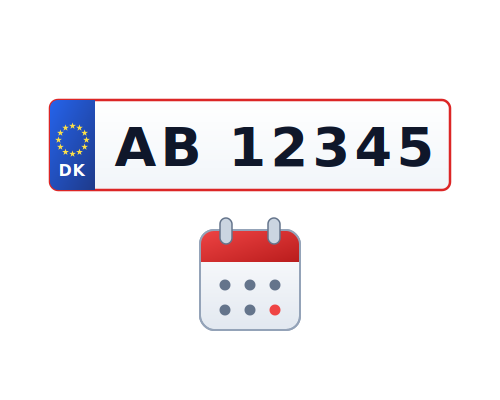

  

<h1 align="center">Næste Syn</h1>

  Track your vehicle's next periodic inspection directly in Home Assistant — countdown sensor, calendar events, and detailed vehicle data updated automatically every 24 hours.

  
  
  

  

---

## Features

- Countdown sensor showing **days until next inspection** (negative = overdue)
- Sensors for **next inspection date** and **last inspection date**
- Optional sensors: mileage at last inspection, VIN, make, model, model year, vehicle use type
- **Calendar entity** with an event for the next inspection — visible in the HA Calendar dashboard and available to automations
- Supports multiple vehicles — add one config entry per registration number
- Data fetched from [MotorAPI](https://www.motorapi.dk), which queries the official Danish Motor Register (Motorregistret)

---

## Requirements

| Requirement | Version / Details |
|---|---|
| Home Assistant | 2023.1 or newer |
| MotorAPI API key | Free — apply at [www.motorapi.dk](https://www.motorapi.dk) |

---

## Installation

### Automatic — via HACS

1. Open **HACS** in Home Assistant.
2. Go to **Integrations** → three-dot menu (⋮) → **Custom repositories**.
3. Add `https://github.com/macokay/hacs-naeste-syn` as **Integration**.
4. Search for **Næste Syn** and click **Download**.
5. Restart Home Assistant.

### Manual

1. Download the latest release from [GitHub Releases](https://github.com/macokay/hacs-naeste-syn/releases).
2. Copy the `custom_components/naeste_syn` folder to your `config/custom_components/` directory.
3. Restart Home Assistant.

---

## Configuration

1. Go to **Settings → Devices & Services → Add Integration**.
2. Search for **Næste Syn**.
3. Enter the required fields:

| Field | Description |
|---|---|
| API key | Your MotorAPI key from motorapi.dk |
| Registration number | Vehicle license plate (e.g. `AB12345`) |

Post-setup options are available via **Configure** on the integration card:

| Option | Description | Default |
|---|---|---|
| Mileage at last inspection | Enable odometer sensor | Off |
| VIN | Enable chassis number sensor | Off |
| Make | Enable vehicle make sensor | Off |
| Model | Enable vehicle model sensor | Off |
| Model year | Enable model year sensor | Off |
| Vehicle use | Enable vehicle use type sensor | Off |

---

## Data

### Entities

| Entity | Always shown | Type | Description |
|---|---|---|---|
| `sensor.days_until_next_inspection` | Yes | `int` | Countdown in days (negative = overdue) |
| `sensor.next_inspection_date` | Yes | `string` | Date of next periodic inspection (ISO) |
| `sensor.last_inspection_date` | Yes | `string` | Date of most recent inspection (ISO) |
| `sensor.registration_number` | Yes | `string` | Vehicle license plate |
| `sensor.mileage_at_last_inspection` | Optional | `int` | Odometer reading (km) at last inspection |
| `sensor.vin` | Optional | `string` | Vehicle chassis number |
| `sensor.make` | Optional | `string` | e.g. `OPEL` |
| `sensor.model` | Optional | `string` | e.g. `ASTRA` |
| `sensor.model_year` | Optional | `int` | e.g. `2017` |
| `sensor.vehicle_use` | Optional | `string` | e.g. `Privat personkørsel` |
| `calendar.inspection_{registration}` | Yes | calendar | Event for next inspection date |

### Update interval

Data is fetched every 24 hours.

---

## Updating

**Via HACS:** HACS will notify you when an update is available. Click **Update** on the integration card.

**Manual:** Replace the `custom_components/naeste_syn` folder with the new version and restart Home Assistant.

---

## Known Limitations

- Data availability depends on MotorAPI — if the vehicle is not registered in Motorregistret, no data is returned
- Inspection date is the scheduled deadline, not a confirmed appointment

---

## Credits

- [MotorAPI](https://www.motorapi.dk) — vehicle inspection data from the Danish Motor Register (Motorregistret)

---

## License

&copy; 2026 Mac O Kay. Free to use and modify for personal, non-commercial use. Attribution appreciated if you share or build upon this work. Commercial use is not permitted.
